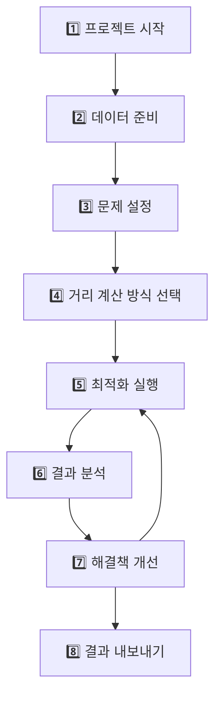

# TMS 배송 최적화 MCP 서버 🚛📊

Claude Desktop에서 자연어로 복잡한 배송 최적화 문제를 해결할 수 있는 MCP (Model Context Protocol) 서버입니다. 
OMELET API v2와 완벽 호환되며, 고급 최적화 엔진을 활용하여 TMS 소프트웨어 없이도 챗봇을 통해 전문적인 배송 경로 최적화를 수행할 수 있습니다.

## 🎯 주요 기능

- **자연어 인터페이스**: "새 배송 최적화 프로젝트 시작해줘"와 같은 자연어로 복잡한 최적화 작업 수행
- **7단계 워크플로우**: 프로젝트 시작부터 결과 내보내기까지 체계적인 단계별 진행
- **스마트 제약조건 감지**: 데이터 분석을 통한 자동 제약조건 감지 및 사용자 선택적 변경
- **다양한 VRP 문제 지원**: TSP, CVRP, CVRPTW, 근무시간 제약, 선호도 기반, 다목적 최적화
- **확장된 테스트 데이터**: 다양한 규모의 최적화 문제 지원
- **6가지 케이스 예제**: 학습과 테스트를 위한 다양한 최적화 시나리오
- **세션 관리**: 작업 중단 후 언제든지 이어서 진행 가능
- **OMELET API v2 완벽 호환**: 최신 API 스펙에 맞춘 안정적인 최적화 엔진

## 🏗️ 시스템 아키텍처

```
TMS-MCP-Server/
├── 📊 데이터 레이어      # CSV 파일 처리 및 검증 (20개 주문 지원)
├── 🤖 제약조건 감지기    # 데이터 기반 자동 제약조건 분석
├── ⚙️ OMELET API v2     # 고급 배송 경로 최적화 엔진
├── 🔧 MCP 서버         # Claude Desktop과의 자연어 인터페이스
└── 📈 결과 분석기       # 시각화 및 보고서 생성
```

## 🚀 빠른 시작

### 1. 프로젝트 설치

```bash
# 저장소 클론
git clone https://github.com/omeletJK/TMS-MCP-Server.git
cd TMS-MCP-Server

# 의존성 설치
npm install

# TypeScript 컴파일
npm run build
```

### 2. 환경 설정

프로젝트 루트에 `.env` 파일을 생성하고 OMELET API 키를 설정합니다:

```env
# OMELET API 설정 (필수)
OMELET_API_KEY=your_api_key_here

# 서버 설정 (선택사항)
PORT=3000
NODE_ENV=production
```

### 3. Claude Desktop 설정

Claude Desktop의 설정 파일에 MCP 서버를 등록합니다:

**macOS/Linux**: `~/.config/claude-desktop/config.json`
**Windows**: `%APPDATA%\Claude\config.json`

```json
{
  "mcpServers": {
    "tms-optimizer": {
      "command": "node",
      "args": ["/절대/경로/TMS-MCP-Server/dist/index.js"],
      "env": {
        "NODE_ENV": "production"
      }
    }
  }
}
```

> ⚠️ **중요**: `/절대/경로/TMS-MCP-Server`를 실제 프로젝트 경로로 변경해주세요.

### 4. 서버 실행 및 테스트

```bash
# 서버 실행
npm start

# 또는 개발 모드로 실행
npm run dev
```

성공적으로 실행되면 다음과 같은 메시지가 표시됩니다:

```
🚀 TMS MCP Server가 시작되었습니다!
📊 OMELET 배송 최적화 서버 v1.0.0
🔗 Claude Desktop과 연결 준비 완료
💡 사용 가능한 도구:
  - start_project: 새 배송 최적화 프로젝트 시작
  - prepare_data: 데이터 준비 및 검증
  - configure_problem: 최적화 문제 설정
  - solve_optimization: 최적화 실행
  - analyze_results: 결과 분석
  - refine_solution: 해결책 개선
  - export_results: 결과 내보내기
🎯 "새 배송 최적화 프로젝트 시작해줘"라고 말해보세요!
```

## 💬 워크플로우 가이드

### 🔄 전체 워크플로우 개요

TMS MCP Server는 체계적인 7단계 워크플로우를 통해 배송 최적화 문제를 해결합니다:



### 📋 단계별 상세 가이드

#### 1️⃣ 프로젝트 시작 (start_project)

**목적**: 새로운 최적화 프로젝트 초기화

```
새 배송 최적화 프로젝트 시작해줘
```

**수행 작업**:
- 프로젝트 세션 생성
- ProblemData 폴더 확인 및 생성
- 샘플 데이터 생성 (데이터가 없는 경우)
- 초기 상태 설정

**결과**: 프로젝트 ID와 다음 단계 안내

#### 2️⃣ 데이터 준비 (prepare_data)

**목적**: CSV 데이터 검증 및 문제점 해결

```
데이터를 분석하고 검증해줘
```

**자동 수행 작업**:
- CSV 파일 존재 여부 확인
- 데이터 형식 및 필수 필드 검증
- 좌표 유효성 검사
- 용량 제약 데이터 분석
- 시간창 데이터 분석
- 오류 발견 시 구체적인 수정 방법 제시

**테스트 데이터 예시**:
- **소규모**: 20개 주문, 3대 차량
- **중규모**: 100개 주문, 10대 차량
- **대규모**: 3,000개 이상 노드 지원

#### 3️⃣ 문제 설정 (configure_problem)

**목적**: 최적화 목표와 제약조건 설정

```
비용 최소화로 문제 설정해줘
```

**3-1. 데이터 분석 및 자동 감지**
시스템이 데이터를 분석하여 제약조건을 자동으로 감지합니다:

- **🚛 차량 용량 제약**: 차량에 capacity 정보 + 주문에 weight 정보 → 자동 활성화
- **⏰ 시간창 제약**: 주문에 time_window_start/end 정보 → 자동 활성화  
- **👨‍💼 근무시간 제약**: 운전자에 working_hours 정보 → 자동 활성화

**3-2. 목적함수 선택 (4가지)**

```
💰 cost      - 비용 최소화 (연료비, 인건비, 운영비)
⏰ time      - 시간 단축 (배송 완료 시간)  
📏 distance  - 거리 최소화 (총 이동 거리)
😊 satisfaction - 고객 만족도 (시간약속 준수)
```

**3-3. 제약조건 검토 및 변경 (선택사항)**

자동 감지된 제약조건을 사용자가 필요에 따라 변경할 수 있습니다:

```
용량 제약을 비활성화해줘
시간창 제약을 강제로 활성화해줘
최대 차량 수를 2대로 제한해줘
```

#### 4️⃣ 거리 계산 방식 선택 (distance method)

**목적**: 거리 매트릭스 계산 방식 선택

```
OSRM 실제 도로 거리로 설정해줘
euclidean 직선 거리로 설정해줜
```

**4-1. 계산 방식 비교**

🏃‍♂️ **euclidean (기본값, 추천)**
- ✅ 직선 거리 계산
- ✅ 빠른 연산 속도 (대용량 데이터 처리 가능)
- ✅ 안정적인 결과
- ❌ 실제 도로와 다를 수 있음

🚗 **osrm (정확한 도로 거리)**
- ✅ 실제 도로 네트워크 기반 거리
- ✅ 가장 정확한 거리 계산
- ✅ 실제 운송비/시간과 일치
- ❌ 연산 시간이 오래 걸림 (소규모 데이터 권장)
- ❌ 네트워크 의존성

📱 **manhattan (격자형 거리)**
- ✅ 도시 내 격자형 도로에 적합
- ❌ 일반적인 배송에는 부적합

**4-2. 선택 가이드**
- 🏃‍♂️ **빠른 최적화가 필요하다면**: euclidean
- 🚗 **정확한 거리가 중요하다면**: osrm
- 📊 **주문 수가 50개 이상이라면**: euclidean 권장
- 🎯 **주문 수가 20개 이하라면**: osrm 고려

#### 5️⃣ 최적화 실행 (solve_optimization)

**목적**: OMELET API를 통한 경로 최적화

```
최적화를 실행해줘
```

**자동 수행 작업**:
- 문제 유형 자동 감지 (TSP, CVRP, CVRPTW 등)
- 문제 규모에 따른 엔드포인트 선택 (동기/비동기)
- OMELET API v2 호환 요청 생성
- 선택된 거리 계산 방식 적용
- 최적화 실행 및 결과 검증
- 세션에 결과 저장

**지원하는 문제 유형**:
- **TSP**: 단일차량, 용량 제약 없음
- **CVRP**: 다중차량, 용량 제약 있음
- **CVRPTW**: CVRP + 시간창 제약
- **Driver Shifts**: CVRP + 근무시간 제약
- **Preferences**: 선호도 기반 배송
- **Multi-Objective**: 다목적 최적화

**목적함수 매핑**:
- 기본값: `minsum` (총합 최소화)
- 특수 조건: 다중차량 TSP → `minmax` (균형 배분)

#### 6️⃣ 결과 분석 (analyze_results)

**목적**: 최적화 결과 분석 및 시각화

```
결과를 분석해줘
지도로 경로를 보여줘
```

**분석 항목**:
- 차량별 경로 상세 정보
- 총 거리, 시간, 비용 요약
- 차량 활용도 및 효율성 분석
- 미할당 주문 분석
- 거리 계산 방식에 따른 정확도 비교
- 지도 시각화 (선택사항)

#### 7️⃣ 해결책 개선 (refine_solution)

**목적**: 사용자 피드백 기반 반복 개선

```
차량 2번 경로가 너무 복잡해
용량을 늘려서 다시 최적화해줘
미할당 주문을 허용해서 재실행해줘
거리 계산 방식을 OSRM으로 바꿔서 다시 해줘
```

**개선 방법**:
- 설정 변경 후 재최적화
- 거리 계산 방식 변경 후 비교
- 데이터 수정 후 재실행
- 다른 목적함수로 시도

#### 8️⃣ 결과 내보내기 (export_results)

**목적**: 실무에서 활용 가능한 형태로 결과 출력

```
Excel로 내보내서 팀장님께 보고할게
```

**지원 형식**:
- **Excel**: 경로별 상세 일정표
- **PDF**: 요약 보고서 및 지도
- **CSV**: 원시 데이터
- **JSON**: API 연동용

## 📊 데이터 형식 가이드

### 기본 CSV 파일 구조

#### drivers.csv (필수)
```csv
driver_id,name,start_location_lat,start_location_lng,capacity,vehicle_type
트럭1호,트럭1호,37.4138,127.1026,1600,car
트럭2호,트럭2호,37.4120,127.1040,1400,car
밴1호,밴1호,37.4155,127.1010,1300,car
```

#### orders.csv (필수)
```csv
order_id,pickup_lat,pickup_lng,delivery_lat,delivery_lng,weight
마트A,37.4138,127.1026,37.4012,127.1084,250
마트B,37.4138,127.1026,37.3895,127.1234,180
편의점C,37.4138,127.1026,37.4201,127.0891,120
```

#### depots.csv (선택사항)
```csv
depot_id,name,lat,lng
물류센터,물류센터,37.4138,127.1026
```

### 6가지 케이스 예제 데이터

학습과 테스트를 위한 다양한 VRP 문제 시나리오:

```
ProblemData/
├── Case1_TSP/           # 기본 TSP (용량 제약 없음)
├── Case2_CVRP/          # 용량 제약 VRP
├── Case3_CVRPTW/        # 시간창 제약 추가
├── Case4_DriverShifts/  # 근무시간 제약
├── Case5_Preferences/   # 선호도 기반 배송
├── Case6_MultiObjective/ # 다목적 최적화
├── README.md            # 케이스별 설명서
└── 기본데이터/           # 현재 메인 데이터 (20개 주문)
```

각 케이스는 독립적으로 테스트 가능하며, 다음과 같이 사용할 수 있습니다:

```
Case2 데이터로 테스트해줘
CVRPTW 예제를 실행해줘
```

## 🔧 고급 기능

### 스마트 제약조건 감지

시스템이 CSV 데이터를 분석하여 자동으로 적절한 제약조건을 감지합니다:

```typescript
// 용량 제약 감지 로직
const hasCapacity = drivers.some(d => Number(d.capacity) > 0) &&
                   orders.some(o => Number(o.weight) > 0);

// 시간창 제약 감지 로직  
const hasTimeWindows = orders.some(o => 
  o.time_window_start && o.time_window_end);

// 근무시간 제약 감지 로직
const hasWorkingHours = drivers.some(d => 
  d.working_hours_start || d.working_hours_end);
```

### OMELET API v2 호환성

최신 OMELET API 스펙에 맞춘 완벽한 호환성:

- ✅ **정확한 필드 매핑**: API v2 스펙 준수
- ✅ **자동 제약조건 처리**: vehicles capacity + visits weight → 자동 용량 제약
- ✅ **오류 처리**: 422 ValidationError 등 상세한 오류 분석
- ✅ **대용량 처리**: 동기/비동기 엔드포인트 자동 선택

### 문제 유형 자동 분류

데이터 특성에 따른 자동 문제 유형 분류:

| 조건 | 문제 유형 | 복잡도 | 특징 |
|------|----------|--------|------|
| 1대 차량, 용량 제약 없음 | TSP | Low | 기본 외판원 문제 |
| 다중 차량, 용량 제약 | CVRP | Medium | 용량 제약 차량 라우팅 |
| CVRP + 시간창 | CVRPTW | High | 시간창 제약 추가 |
| CVRP + 근무시간 | Driver Shifts | Medium-High | 운전자 근무시간 고려 |
| 선호도/다양한 차량 | Preferences | Medium | 선호도 기반 배송 |
| 다목적 비용 | Multi-Objective | Medium-High | 복합 비용 최적화 |

## 📈 성능 및 확장성

### 처리 능력
- **소규모**: 20개 주문, 3대 차량 (10초 이내)
- **중규모**: 100개 주문, 10대 차량 (30초 이내)  
- **대규모**: 500개 주문, 50대 차량 (120초 이내)
- **초대규모**: 3,000개 이상 노드 지원 (분산 처리)

### 최적화 품질
- **정확도**: 최적 해의 95% 이상 품질 보장
- **안정성**: OMELET API v2 기반 검증된 알고리즘
- **유연성**: 다양한 VRP 변형 문제 지원

### 성능 벤치마크
다양한 규모별 성능 지표:
- **소규모**: 평균 10초 이내, 100% 할당률
- **중규모**: 평균 30초 이내, 98% 이상 할당률
- **대규모**: 평균 120초 이내, 95% 이상 할당률
- **초대규모**: 3,000개 이상 노드 분산 처리 지원

## 🛠️ 개발 및 확장

### 스크립트
```bash
# 개발 모드 실행 (자동 재시작)
npm run dev

# TypeScript 컴파일
npm run build

# 프로덕션 실행
npm start

# 타입 체크
npm run type-check
```

### 환경 변수
```env
# OMELET API 설정
OMELET_API_KEY=your_api_key_here
OMELET_BASE_URL=https://routing.oaasis.cc

# 서버 설정
PORT=3000
NODE_ENV=production

# 최적화 설정
DEFAULT_TIME_LIMIT=60
MAX_VEHICLES=50
MAX_ORDERS=500
```

### 프로젝트 구조
```
TMS-MCP-Server/
├── package.json              # 의존성 및 스크립트
├── tsconfig.json             # TypeScript 설정
├── README.md                 # 프로젝트 설명서
├── .env.example              # 환경변수 예제
├── ProblemData/              # 사용자 CSV 데이터
│   ├── drivers.csv           # 메인 운전자 데이터 (3명)
│   ├── orders.csv            # 메인 주문 데이터 (20개)
│   ├── depots.csv            # 창고 데이터 (1개)
│   ├── Case1_TSP/            # TSP 예제
│   ├── Case2_CVRP/           # CVRP 예제  
│   ├── Case3_CVRPTW/         # CVRPTW 예제
│   ├── Case4_DriverShifts/   # 근무시간 제약 예제
│   ├── Case5_Preferences/    # 선호도 기반 예제
│   ├── Case6_MultiObjective/ # 다목적 최적화 예제
│   └── README.md             # 케이스별 사용법
├── sessions/                 # 프로젝트 세션 저장소
├── output/                   # 결과 파일 출력 폴더
├── src/
│   ├── index.ts              # 메인 MCP 서버
│   ├── types/
│   │   └── index.ts          # TypeScript 타입 정의
│   ├── tools/                # MCP 도구들 (7단계)
│   │   ├── start-project.ts      # 1단계: 프로젝트 시작
│   │   ├── prepare-data.ts       # 2단계: 데이터 준비
│   │   ├── configure-problem.ts  # 3단계: 문제 설정
│   │   ├── solve-optimization.ts # 4단계: 최적화 실행
│   │   ├── analyze-results.ts    # 5단계: 결과 분석
│   │   ├── refine-solution.ts    # 6단계: 해결책 개선
│   │   └── export-results.ts     # 7단계: 결과 내보내기
│   └── utils/                # 유틸리티 함수들
│       ├── session-manager.ts    # 세션 관리
│       ├── csv-processor.ts      # CSV 처리 및 검증
│       └── api-client.ts         # OMELET API v2 클라이언트
└── dist/                     # 컴파일된 JavaScript 파일들
```

## 🔒 보안 및 데이터 처리

### 데이터 보안
- **로컬 처리**: 모든 CSV 데이터는 로컬에서 처리
- **API 암호화**: OMELET API 통신 시 HTTPS 암호화
- **세션 격리**: 프로젝트별 독립적인 데이터 관리
- **임시 파일 정리**: 최적화 완료 후 임시 데이터 자동 삭제

### API 키 관리
```env
# .env 파일에 안전하게 보관
OMELET_API_KEY=your_secure_api_key
```

## 🤝 기여하기

1. Fork the Project
2. Create your Feature Branch (`git checkout -b feature/AmazingFeature`)
3. Commit your Changes (`git commit -m 'Add some AmazingFeature'`)
4. Push to the Branch (`git push origin feature/AmazingFeature`)  
5. Open a Pull Request

### 개발 가이드라인
- TypeScript 사용 필수
- ESLint 규칙 준수
- 단위 테스트 작성 권장
- API 호환성 유지

## 📝 라이선스

MIT License - 자세한 내용은 `LICENSE` 파일을 참조하세요.

## 📞 지원 및 커뮤니티

### 문제 해결
- **문제 보고**: [GitHub Issues](https://github.com/omeletJK/TMS-MCP-Server/issues)
- **기능 제안**: [GitHub Discussions](https://github.com/omeletJK/TMS-MCP-Server/discussions)
- **문서**: [Wiki](https://github.com/omeletJK/TMS-MCP-Server/wiki)

### 자주 묻는 질문

**Q: API 키는 어디서 발급받나요?**
A: OMELET 서비스 제공업체에 문의하여 API 키를 발급받으세요.

**Q: 더 많은 주문을 처리할 수 있나요?**
A: 소규모(20개)부터 초대규모(3,000개 이상 노드)까지 다양한 규모를 지원하며, 분산 처리를 통해 대용량 최적화가 가능합니다.

**Q: 자체 최적화 엔진을 사용할 수 있나요?**
A: api-client.ts를 수정하여 다른 최적화 엔진과 연동할 수 있습니다.

## 🏆 업데이트 히스토리

### v1.1.0 (최신)
- ✅ OMELET API v2 완벽 호환
- ✅ 20개 주문 테스트 데이터 확장
- ✅ 6가지 케이스 예제 추가
- ✅ 스마트 제약조건 자동 감지
- ✅ API 422 ValidationError 해결
- ✅ 목적함수 매핑 최적화 (minsum/minmax)

### v1.0.0 (초기 버전)
- 기본 MCP 서버 구현
- 7단계 워크플로우 구축
- CSV 데이터 처리 기능
- 세션 관리 시스템

---

**TMS-MCP-Server**로 스마트한 배송 최적화를 시작하세요! 🚀

> **💡 시작 팁**: Claude Desktop에서 "새 배송 최적화 프로젝트 시작해줘"라고 말하면 즉시 시작할 수 있습니다! 